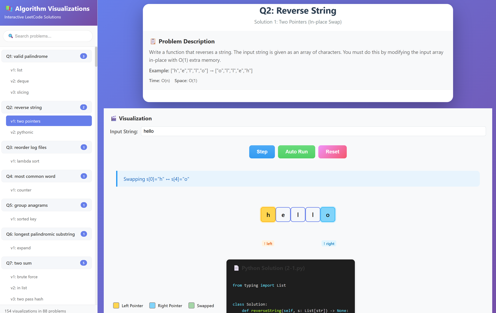

# Python Algorithm Interview

> [!IMPORTANT]  
> Translated version from the [Korean version](https://github.com/onlybooks/python-algorithm-interview)
 into English with D3.js visualization — master coding tests with 95 algorithm problems.

## 🚀 Quick Start

**👉 Open index.html** to browse all problems with interactive visualizations.

★ Errata: https://www.onlybook.co.kr/entry/algorithm-interview-errata  
★ Book Info: https://www.onlybook.co.kr/entry/algorithm-interview  
★ YouTube: https://www.youtube.com/watch?v=fNyGHpSWhTA

<!-- > python -m http.server 8000 -->

## Problem Solutions
| # | Title | Difficulty | Chapter | Solution Code |
| --- | --- | ---- | - | --- |
| 1 | [Valid Palindrome](https://leetcode.com/problems/valid-palindrome/) | ★ | Ch6. String Manipulation | [1-1.py](2-python/ch06/1-1.py) [1-2.py](2-python/ch06/1-2.py) [1-3.py](2-python/ch06/1-3.py) [1-4.c](2-python/ch06/1-4.c) |
| 2 | [Reverse String](https://leetcode.com/problems/reverse-string/) | ★ | Ch6. String Manipulation | [2-1.py](2-python/ch06/2-1.py) [2-2.py](2-python/ch06/2-2.py) |
| 3 | [Reorder Data in Log Files](https://leetcode.com/problems/reorder-data-in-log-files/) | ★ | Ch6. String Manipulation | [3-1.py](2-python/ch06/3-1.py) |
| 4 | [Most Common Word](https://leetcode.com/problems/most-common-word/) | ★ | Ch6. String Manipulation | [4-1.py](2-python/ch06/4-1.py) |
| 5 | [Group Anagrams](https://leetcode.com/problems/group-anagrams/) | ★★ | Ch6. String Manipulation | [5-1.py](2-python/ch06/5-1.py) |
| 6 | [Longest Palindromic Substring](https://leetcode.com/problems/longest-palindromic-substring/) | ★★ | Ch6. String Manipulation | [6-1.py](2-python/ch06/6-1.py) |
| 7 | [Two Sum](https://leetcode.com/problems/two-sum/) | ★ | Ch7. Arrays | [7-1.py](3-linear-data-structures/ch07/7-1.py) [7-2.py](3-linear-data-structures/ch07/7-2.py) [7-3.py](3-linear-data-structures/ch07/7-3.py) [7-4.py](3-linear-data-structures/ch07/7-4.py) [7-5.py](3-linear-data-structures/ch07/7-5.py) [7-6.go](3-linear-data-structures/ch07/7-6.go) |
| 8 | [Trapping Rain Water](https://leetcode.com/problems/trapping-rain-water/) | ★★★ | Ch7. Arrays | [8-1.py](3-linear-data-structures/ch07/8-1.py) [8-2.py](3-linear-data-structures/ch07/8-2.py) |
| 9 | [3Sum](https://leetcode.com/problems/3sum/) | ★★ | Ch7. Arrays | [9-1.py](3-linear-data-structures/ch07/9-1.py) [9-2.py](3-linear-data-structures/ch07/9-2.py) |
| 10 | [Array Partition I](https://leetcode.com/problems/array-partition/) | ★ | Ch7. Arrays | [10-1.py](3-linear-data-structures/ch07/10-1.py) [10-2.py](3-linear-data-structures/ch07/10-2.py) [10-3.py](3-linear-data-structures/ch07/10-3.py) |
| 11 | [Product of Array Except Self](https://leetcode.com/problems/product-of-array-except-self/) | ★★ | Ch7. Arrays | [11-1.py](3-linear-data-structures/ch07/11-1.py) |
| 12 | [Best Time to Buy and Sell Stock](https://leetcode.com/problems/best-time-to-buy-and-sell-stock/) | ★ | Ch7. Arrays | [12-1.py](3-linear-data-structures/ch07/12-1.py) [12-2.py](3-linear-data-structures/ch07/12-2.py) |
| 13 | [Palindrome Linked List](https://leetcode.com/problems/palindrome-linked-list/) | ★ | Ch8. Linked Lists | [13-1.py](3-linear-data-structures/ch08/13-1.py) [13-2.py](3-linear-data-structures/ch08/13-2.py) [13-3.go](3-linear-data-structures/ch08/13-3.go) [13-4.py](3-linear-data-structures/ch08/13-4.py) |
| 14 | [Merge Two Sorted Lists](https://leetcode.com/problems/merge-two-sorted-lists/) | ★ | Ch8. Linked Lists | [14-1.py](3-linear-data-structures/ch08/14-1.py) |
| 15 | [Reverse Linked List](https://leetcode.com/problems/reverse-linked-list/) | ★ | Ch8. Linked Lists | [15-1.py](3-linear-data-structures/ch08/15-1.py) [15-2.py](3-linear-data-structures/ch08/15-2.py) |
| 16 | [Add Two Numbers](https://leetcode.com/problems/add-two-numbers/) | ★★ | Ch8. Linked Lists | [16-1.py](3-linear-data-structures/ch08/16-1.py) [16-2.py](3-linear-data-structures/ch08/16-2.py) |
| 17 | [Swap Nodes in Pairs](https://leetcode.com/problems/swap-nodes-in-pairs/) | ★★ | Ch8. Linked Lists | [17-1.py](3-linear-data-structures/ch08/17-1.py) [17-2.py](3-linear-data-structures/ch08/17-2.py) [17-3.py](3-linear-data-structures/ch08/17-3.py) |
| 18 | [Odd Even Linked List](https://leetcode.com/problems/odd-even-linked-list/) | ★★ | Ch8. Linked Lists | [18-1.py](3-linear-data-structures/ch08/18-1.py) |
| 19 | [Reverse Linked List II](https://leetcode.com/problems/reverse-linked-list-ii/) | ★★ | Ch8. Linked Lists | [19-1.py](3-linear-data-structures/ch08/19-1.py) |
| 20 | [Valid Parentheses](https://leetcode.com/problems/valid-parentheses/) | ★ | Ch9. Stack, Queue | [20-1.py](3-linear-data-structures/ch09/20-1.py) |
| 21 | [Remove Duplicate Letters](https://leetcode.com/problems/remove-duplicate-letters/) | ★★★ | Ch9. Stack, Queue | [21-1.py](3-linear-data-structures/ch09/21-1.py) [21-2.py](3-linear-data-structures/ch09/21-2.py) |
| 22 | [Daily Temperatures](https://leetcode.com/problems/daily-temperatures/) | ★★ | Ch9. Stack, Queue | [22-1.py](3-linear-data-structures/ch09/22-1.py) |
| 23 | [Implement Stack using Queues](https://leetcode.com/problems/implement-stack-using-queues/) | ★ | Ch9. Stack, Queue | [23-1.py](3-linear-data-structures/ch09/23-1.py) |
| 24 | [Implement Queue using Stacks](https://leetcode.com/problems/implement-queue-using-stacks/) | ★ | Ch9. Stack, Queue | [24-1.py](3-linear-data-structures/ch09/24-1.py) |
| 25 | [Design Circular Queue](https://leetcode.com/problems/design-circular-queue/) | ★★ | Ch9. Stack, Queue | [25-1.py](3-linear-data-structures/ch09/25-1.py) |
| 26 | [Design Circular Deque](https://leetcode.com/problems/design-circular-deque/) | ★★ | Ch10. Deque, Priority Queue | [26-1.py](3-linear-data-structures/ch10/26-1.py) |
| 27 | [Merge k Sorted Lists](https://leetcode.com/problems/merge-k-sorted-lists/) | ★ | Ch10. Deque, Priority Queue | [27-1.py](3-linear-data-structures/ch10/27-1.py) |
| 28 | [Design HashMap](https://leetcode.com/problems/design-hashmap/) | ★ | Ch11. Hash Table | [28-1.py](3-linear-data-structures/ch11/28-1.py) |
| 29 | [Jewels and Stones](https://leetcode.com/problems/jewels-and-stones/) | ★ | Ch11. Hash Table | [29-1.py](3-linear-data-structures/ch11/29-1.py) [29-2.py](3-linear-data-structures/ch11/29-2.py) [29-3.py](3-linear-data-structures/ch11/29-3.py) [29-4.py](3-linear-data-structures/ch11/29-4.py) |
| 30 | [Longest Substring Without Repeating Characters](https://leetcode.com/problems/longest-substring-without-repeating-characters/) | ★★ | Ch11. Hash Table | [30-1.py](3-linear-data-structures/ch11/30-1.py) |
| 31 | [Top K Frequent Elements](https://leetcode.com/problems/top-k-frequent-elements/) | ★★ | Ch11. Hash Table | [31-1.py](3-linear-data-structures/ch11/31-1.py) [31-2.py](3-linear-data-structures/ch11/31-2.py) |
| 32 | [Number of Islands](https://leetcode.com/problems/number-of-islands/) | ★★ | Ch12. Graph | [32-1.py](4-non-linear-data-structures/ch12/32-1.py) |
| 33 | [Letter Combinations of a Phone Number](https://leetcode.com/problems/letter-combinations-of-a-phone-number/) | ★★ | Ch12. Graph | [33-1.py](4-non-linear-data-structures/ch12/33-1.py) |
| 34 | [Permutations](https://leetcode.com/problems/permutations/) | ★★ | Ch12. Graph | [34-1.py](4-non-linear-data-structures/ch12/34-1.py) [34-2.py](4-non-linear-data-structures/ch12/34-2.py) |
| 35 | [Combinations](https://leetcode.com/problems/combinations/) | ★★ | Ch12. Graph | [35-1.py](4-non-linear-data-structures/ch12/35-1.py) [35-2.py](4-non-linear-data-structures/ch12/35-2.py) |
| 36 | [Combination Sum](https://leetcode.com/problems/combination-sum/) | ★★ | Ch12. Graph | [36-1.py](4-non-linear-data-structures/ch12/36-1.py) |
| 37 | [Subsets](https://leetcode.com/problems/subsets/) | ★★ | Ch12. Graph | [37-1.py](4-non-linear-data-structures/ch12/37-1.py) |
| 38 | [Reconstruct Itinerary](https://leetcode.com/problems/reconstruct-itinerary/) | ★★ | Ch12. Graph | [38-1.py](4-non-linear-data-structures/ch12/38-1.py) [38-2.py](4-non-linear-data-structures/ch12/38-2.py) [38-3.py](4-non-linear-data-structures/ch12/38-3.py) |
| 39 | [Course Schedule](https://leetcode.com/problems/course-schedule/) | ★★ | Ch12. Graph | [39-1.py](4-non-linear-data-structures/ch12/39-1.py) [39-2.py](4-non-linear-data-structures/ch12/39-2.py) |
| 40 | [Network Delay Time](https://leetcode.com/problems/network-delay-time/) | ★★ | Ch13. Shortest Path | [40-1.py](4-non-linear-data-structures/ch13/40-1.py) |
| 41 | [Cheapest Flights Within K Stops](https://leetcode.com/problems/cheapest-flights-within-k-stops/) | ★★ | Ch13. Shortest Path | [41-1.py](4-non-linear-data-structures/ch13/41-1.py) |
| 42 | [Maximum Depth of Binary Tree](https://leetcode.com/problems/maximum-depth-of-binary-tree/) | ★ | Ch14. Tree | [42-1.py](4-non-linear-data-structures/ch14/42-1.py) |
| 43 | [Diameter of Binary Tree](https://leetcode.com/problems/diameter-of-binary-tree/) | ★ | Ch14. Tree | [43-1.py](4-non-linear-data-structures/ch14/43-1.py) |
| 44 | [Longest Univalue Path](https://leetcode.com/problems/longest-univalue-path/) | ★ | Ch14. Tree | [44-1.py](4-non-linear-data-structures/ch14/44-1.py) |
| 45 | [Invert Binary Tree](https://leetcode.com/problems/invert-binary-tree/) | ★ | Ch14. Tree | [45-1.py](4-non-linear-data-structures/ch14/45-1.py) [45-2.py](4-non-linear-data-structures/ch14/45-2.py) [45-3.py](4-non-linear-data-structures/ch14/45-3.py) [45-4.py](4-non-linear-data-structures/ch14/45-4.py) |
| 46 | [Merge Two Binary Trees](https://leetcode.com/problems/merge-two-binary-trees/) | ★ | Ch14. Tree | [46-1.py](4-non-linear-data-structures/ch14/46-1.py) |
| 47 | [Serialize and Deserialize Binary Tree](https://leetcode.com/problems/serialize-and-deserialize-binary-tree/) | ★★★ | Ch14. Tree | [47-1.py](4-non-linear-data-structures/ch14/47-1.py) |
| 48 | [Balanced Binary Tree](https://leetcode.com/problems/balanced-binary-tree/) | ★ | Ch14. Tree | [48-1.py](4-non-linear-data-structures/ch14/48-1.py) |
| 49 | [Minimum Height Trees](https://leetcode.com/problems/minimum-height-trees/) | ★★ | Ch14. Tree | [49-1.py](4-non-linear-data-structures/ch14/49-1.py) |
| 50 | [Convert Sorted Array to Binary Search Tree](https://leetcode.com/problems/convert-sorted-array-to-binary-search-tree/) | ★ | Ch14. Tree | [50-1.py](4-non-linear-data-structures/ch14/50-1.py) |
| 51 | [Binary Search Tree to Greater Sum Tree](https://leetcode.com/problems/binary-search-tree-to-greater-sum-tree/) | ★★ | Ch14. Tree | [51-1.py](4-non-linear-data-structures/ch14/51-1.py) |
| 52 | [Range Sum of BST](https://leetcode.com/problems/range-sum-of-bst/) | ★ | Ch14. Tree | [52-1.py](4-non-linear-data-structures/ch14/52-1.py) [52-2.py](4-non-linear-data-structures/ch14/52-2.py) [52-3.py](4-non-linear-data-structures/ch14/52-3.py) [52-4.py](4-non-linear-data-structures/ch14/52-4.py) |
| 53 | [Minimum Distance Between BST Nodes](https://leetcode.com/problems/minimum-distance-between-bst-nodes/) | ★ | Ch14. Tree | [53-1.py](4-non-linear-data-structures/ch14/53-1.py) [53-2.py](4-non-linear-data-structures/ch14/53-2.py) |
| 54 | [Construct Binary Tree from Preorder and Inorder Traversal](https://leetcode.com/problems/construct-binary-tree-from-preorder-and-inorder-traversal/) | ★★ | Ch14. Tree | [54-1.py](4-non-linear-data-structures/ch14/54-1.py) |
| 55 | [Kth Largest Element in an Array](https://leetcode.com/problems/kth-largest-element-in-an-array/) | ★★ | Ch15. Heap | [55-1.py](4-non-linear-data-structures/ch15/55-1.py) [55-2.py](4-non-linear-data-structures/ch15/55-2.py) [55-3.py](4-non-linear-data-structures/ch15/55-3.py) [55-4.py](4-non-linear-data-structures/ch15/55-4.py) |
| 56 | [Implement Trie (Prefix Tree)](https://leetcode.com/problems/implement-trie-prefix-tree/) | ★★ | Ch16. Trie | [56-1.py](4-non-linear-data-structures/ch16/56-1.py) |
| 57 | [Palindrome Pairs](https://leetcode.com/problems/palindrome-pairs/) | ★★★ | Ch16. Trie | [57-1.py](4-non-linear-data-structures/ch16/57-1.py) [57-2.py](4-non-linear-data-structures/ch16/57-2.py) |
| 58 | [Sort List](https://leetcode.com/problems/sort-list/) | ★★ | Ch17. Sorting | [58-1.py](5-algorithms/ch17/58-1.py) [58-3.py](5-algorithms/ch17/58-3.py) |
| 59 | [Merge Intervals](https://leetcode.com/problems/merge-intervals/) | ★★ | Ch17. Sorting | [59-1.py](5-algorithms/ch17/59-1.py) |
| 60 | [Insertion Sort List](https://leetcode.com/problems/insertion-sort-list/) | ★★ | Ch17. Sorting | [60-1.py](5-algorithms/ch17/60-1.py) [60-2.py](5-algorithms/ch17/60-2.py) |
| 61 | [Largest Number](https://leetcode.com/problems/largest-number/) | ★★ | Ch17. Sorting | [61-1.py](5-algorithms/ch17/61-1.py) |
| 62 | [Valid Anagram](https://leetcode.com/problems/valid-anagram/) | ★ | Ch17. Sorting | [62-1.py](5-algorithms/ch17/62-1.py) |
| 63 | [Sort Colors](https://leetcode.com/problems/sort-colors/) | ★★ | Ch17. Sorting | [63-1.py](5-algorithms/ch17/63-1.py) |
| 64 | [K Closest Points to Origin](https://leetcode.com/problems/k-closest-points-to-origin/) | ★★ | Ch17. Sorting | [64-1.py](5-algorithms/ch17/64-1.py) |
| 65 | [Binary Search](https://leetcode.com/problems/binary-search/) | ★ | Ch18. Binary Search | [65-1.py](5-algorithms/ch18/65-1.py) [65-2.py](5-algorithms/ch18/65-2.py) [65-3.py](5-algorithms/ch18/65-3.py) [65-4.py](5-algorithms/ch18/65-4.py) |
| 66 | [Search in Rotated Sorted Array](https://leetcode.com/problems/search-in-rotated-sorted-array/) | ★★ | Ch18. Binary Search | [66-1.py](5-algorithms/ch18/66-1.py) |
| 67 | [Intersection of Two Arrays](https://leetcode.com/problems/intersection-of-two-arrays/) | ★ | Ch18. Binary Search | [67-1.py](5-algorithms/ch18/67-1.py) [67-2.py](5-algorithms/ch18/67-2.py) [67-3.py](5-algorithms/ch18/67-3.py) |
| 68 | [Two Sum II - Input Array Is Sorted](https://leetcode.com/problems/two-sum-ii-input-array-is-sorted/) | ★ | Ch18. Binary Search | [68-1.py](5-algorithms/ch18/68-1.py) [68-2.py](5-algorithms/ch18/68-2.py) [68-3.py](5-algorithms/ch18/68-3.py) [68-4.py](5-algorithms/ch18/68-4.py) [68-5.py](5-algorithms/ch18/68-5.py) |
| 69 | [Search a 2D Matrix II](https://leetcode.com/problems/search-a-2d-matrix-ii/) | ★★ | Ch18. Binary Search | [69-1.py](5-algorithms/ch18/69-1.py) [69-2.py](5-algorithms/ch18/69-2.py) |
| 70 | [Single Number](https://leetcode.com/problems/single-number/) | ★ | Ch19. Bit Manipulation | [70-1.py](5-algorithms/ch19/70-1.py) |
| 71 | [Hamming Distance](https://leetcode.com/problems/hamming-distance/) | ★ | Ch19. Bit Manipulation | [71-1.py](5-algorithms/ch19/71-1.py) |
| 72 | [Sum of Two Integers](https://leetcode.com/problems/sum-of-two-integers/) | ★★★ | Ch19. Bit Manipulation | [72-1.py](5-algorithms/ch19/72-1.py) [72-2.py](5-algorithms/ch19/72-2.py) |
| 73 | [UTF-8 Validation](https://leetcode.com/problems/utf-8-validation/) | ★★ | Ch19. Bit Manipulation | [73-1.py](5-algorithms/ch19/73-1.py) |
| 74 | [Number of 1 Bits](https://leetcode.com/problems/number-of-1-bits/) | ★ | Ch19. Bit Manipulation | [74-1.py](5-algorithms/ch19/74-1.py) [74-2.py](5-algorithms/ch19/74-2.py) |
| 75 | [Sliding Window Maximum](https://leetcode.com/problems/sliding-window-maximum/) | ★★★ | Ch20. Sliding Window | [75-1.py](5-algorithms/ch20/75-1.py) [75-2.py](5-algorithms/ch20/75-2.py) |
| 76 | [Minimum Window Substring](https://leetcode.com/problems/minimum-window-substring/) | ★★★ | Ch20. Sliding Window | [76-1.py](5-algorithms/ch20/76-1.py) [76-2.py](5-algorithms/ch20/76-2.py) [76-3.py](5-algorithms/ch20/76-3.py) |
| 77 | [Longest Repeating Character Replacement](https://leetcode.com/problems/longest-repeating-character-replacement/) | ★★ | Ch20. Sliding Window | [77-1.py](5-algorithms/ch20/77-1.py) |
| 78 | [Best Time to Buy and Sell Stock II](https://leetcode.com/problems/best-time-to-buy-and-sell-stock-ii/) | ★ | Ch21. Greedy Algorithm | [78-1.py](5-algorithms/ch21/78-1.py) [78-2.py](5-algorithms/ch21/78-2.py) |
| 79 | [Queue Reconstruction by Height](https://leetcode.com/problems/queue-reconstruction-by-height/) | ★★ | Ch21. Greedy Algorithm | [79-1.py](5-algorithms/ch21/79-1.py) |
| 80 | [Task Scheduler](https://leetcode.com/problems/task-scheduler/) | ★★ | Ch21. Greedy Algorithm | [80-1.py](5-algorithms/ch21/80-1.py) |
| 81 | [Gas Station](https://leetcode.com/problems/gas-station/) | ★★ | Ch21. Greedy Algorithm | [81-1.py](5-algorithms/ch21/81-1.py) [81-2.py](5-algorithms/ch21/81-2.py) |
| 82 | [Assign Cookies](https://leetcode.com/problems/assign-cookies/) | ★ | Ch21. Greedy Algorithm | [82-1.py](5-algorithms/ch21/82-1.py) [82-2.py](5-algorithms/ch21/82-2.py) |
| 83 | [Majority Element](https://leetcode.com/problems/majority-element/) | ★ | Ch22. Divide and Conquer | [83-1.py](5-algorithms/ch22/83-1.py) [83-2.py](5-algorithms/ch22/83-2.py) [83-3.py](5-algorithms/ch22/83-3.py) [83-4.py](5-algorithms/ch22/83-4.py) |
| 84 | [Different Ways to Add Parentheses](https://leetcode.com/problems/different-ways-to-add-parentheses/) | ★★ | Ch22. Divide and Conquer | [84-1.py](5-algorithms/ch22/84-1.py) |
| 85 | [Fibonacci Number](https://leetcode.com/problems/fibonacci-number/) | ★ | Ch23. Dynamic Programming | [85-1.py](5-algorithms/ch23/85-1.py) [85-2.py](5-algorithms/ch23/85-2.py) [85-3.py](5-algorithms/ch23/85-3.py) [85-4.py](5-algorithms/ch23/85-4.py) |
| 86 | [Maximum Subarray](https://leetcode.com/problems/maximum-subarray/) | ★ | Ch23. Dynamic Programming | [86-1.py](5-algorithms/ch23/86-1.py) [86-2.py](5-algorithms/ch23/86-2.py) |
| 87 | [Climbing Stairs](https://leetcode.com/problems/climbing-stairs/) | ★ | Ch23. Dynamic Programming | [87-1.py](5-algorithms/ch23/87-1.py) [87-2.py](5-algorithms/ch23/87-2.py) |
| 88 | [House Robber](https://leetcode.com/problems/house-robber/) | ★ | Ch23. Dynamic Programming | [88-1.py](5-algorithms/ch23/88-1.py) [88-2.py](5-algorithms/ch23/88-2.py) |

## Additional Code (miscellaneous)
- Ch4 [Performance Comparison](miscellaneous/4-performance.py)
- Ch9 [Stack](miscellaneous/9-stack.py)
- Ch11 [Birthday Problem](miscellaneous/11-birthday.py)
- Ch12 [Graph Traversals](miscellaneous/12-graph-traversals.py)
- Ch14 [Tree Traversals](miscellaneous/14-tree-traversals.py)
- Ch15 [Binary Heap](miscellaneous/15-binary-heap.py)
- Ch17 [Bubble Sort](miscellaneous/17-bubble-sort.py)
- Ch17 [Quick Sort](miscellaneous/17-quick-sort.py)
- Ch21 [Fractional Knapsack Problem](miscellaneous/21-fractional-knapsack.py)
- Ch23 [0-1 Knapsack Problem](miscellaneous/23-zero-one-knapsack.py)

## LeetCode Updates and More Efficient Solutions
- Problem 7: Test cases were removed, resulting in different execution times. [#62](https://github.com/onlybooks/algorithm-interview/issues/62)
- Problem 25: For a more efficient solution, see [#105](https://github.com/onlybooks/algorithm-interview/issues/105).
- Problem 33: For a more efficient solution, see [#91](https://github.com/onlybooks/algorithm-interview/issues/91).
- Problem 35: For a more efficient solution, see [#111](https://github.com/onlybooks/algorithm-interview/issues/111).
- Problem 36: For a more efficient solution, see [#112](https://github.com/onlybooks/algorithm-interview/issues/112).
- Problem 41: Due to test case changes, the solution now times out. [#104](https://github.com/onlybooks/algorithm-interview/issues/104)
- Problem 47: Due to evaluation function changes, comment out the `TreeNode` declaration before running. [#97](https://github.com/onlybooks/algorithm-interview/issues/97)
- Problem 75: Additional test cases were added, solution no longer passes. For new solution, see [#67](https://github.com/onlybooks/algorithm-interview/issues/67).
